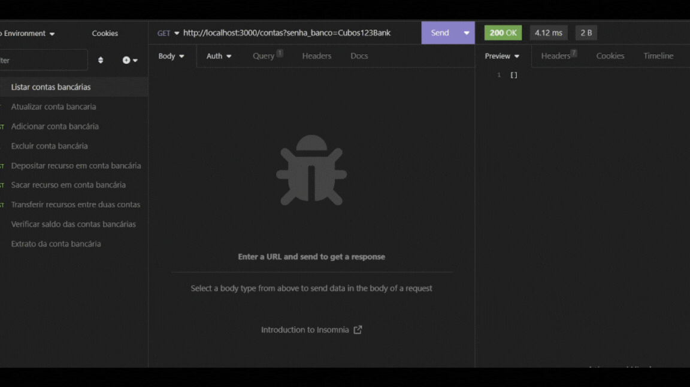

# 🏦 Back-end - API REST de um Banco Digital

  

  
  
  
  
   
   
   

<h4 align=center> 
	🚧 Banco Digital CUBOS 🚧
</h4>

	

## 📝 Sobre o Projeto

Este projeto consiste em uma API REST desenvolvida para simular operações bancárias, como criação de contas, saques, transferências e muito mais. O objetivo é fornecer uma base para a construção de um sistema completo de Banco Digital, seguindo os padrões REST e utilizando tecnologias modernas.

## 📋 Funcionalidades

Nessa API REST é possível:

- Listar contas bancárias (com um middleware obrigatório);
- Criar conta bancária, com requesitos obrigatórios como: nome, cpf, data_nascimento, telefone, email, senha
- Atualizar os dados do usuário da conta bancária;
- Excluir uma conta bancária;
- Depósitar em uma conta bancária;
- Sacar recursos (dinheiro) de uma conta bancária;
- Transferir valores entre contas bancárias;
- Consultar saldo da conta bancária de uma conta específica;
- Emitir extrato bancário de uma conta específica.

## ▶️ Como executar o projeto

### 🏗️ Estrutura da API REST:

A estrutura da API REST foi organizada de forma a manter a clareza e a modularidade do projeto. Os elementos da API REST estão distribuídos dentro da pasta `src`, como segue:

- Arquivo `index.js`: Este é o ponto de entrada da aplicação, onde a execução do servidor é iniciada. Ele configura as dependências necessárias e inicia a escuta por requisições;

- Pasta `controladores`: A pasta controllers contém os arquivos `operacoesContasBancarias.js` e `funcoesSecundarias.js`, que abriga todas as funções responsáveis por executar as operações relacionadas às rotas da API
- Arquivo `rotas.js`: Lugar onde todas as rotas da API são definidas;

- Pasta `dados`: Dentro dessa pasta você encontrará o arquivo `bancodedados.js` responsável por armazenar dados em memória usando um objeto no próprio arquivo;

- Arquivo `intermediario.js`: Contém as definições de middlewares, que são funções intermediárias que podem ser executadas antes das rotas ou após as requisições.

### 🛠️ Pré-requisitos

- Possuir um editor de código-fonte, por exemplo [VSCode](https://code.visualstudio.com/download) ou [Vim](https://www.vim.org/download.php);
- Possuir o [Git](https://git-scm.com/downloads) ou qualquer outro programa de versionamento;
- Possuir o [Node.js](https://nodejs.org/en/download/current) (versão 18.16.0 ou superior);
- Possuir o [Insomnia](https://insomnia.rest/download) instalado.

### ⚙️ Instalação

1. Clone este repositório em sua máquina local:
2. Navegue até o diretório do projeto: `cd nome_da_pasta`;
3. Instale as dependências através do comando: `npm install`;
4. Para executa-lo digite no terminal do seu editor de código: `npm run dev`;
5. No terminal, aparecerá a seguinte mensagem: `O Servidor está sendo executado na porta 3000.`;
6. Após exibir a mensagem acima, execute o Insomnia e configure um novo ambiente para testar as rotas da API.

## 🚀 Tecnologias Utilizadas

- Node.js (versão 18.16.0);
- Express (versão 4.18.2);
- Nodemon (versão 3.0.1);
- Date-fns (versão 2.30.0);
- JavaScript.

## 🎲 Demonstração da Aplicação

<h1 align="center">
    
</h1>

## 🤝 Contribuição

Contribuições são bem-vindas! Se você quiser melhorar ou adicionar novos recursos a esta API, siga as etapas abaixo:

1. Crie um Fork deste repositório;
2. Crie uma branch para suas alterações: `git checkout -b my-feature`;
3. Commit suas alterações: `git commit -m 'Adicionar nova funcionalidade'`;
4. Faça push para a branch: `git push origin my-feature`;
5. Abra um pull request.

## 🧙‍♂️ Autora

Projeto Back-end desenvolvido por [Poliana Santos](https://www.linkedin.com/in/polianams/), como desafio do modulo 2 do curso de Desenvolvimento de Software - Foco em Back-end da [Cubos Academy](https://cubos.academy/) ✨

---

## 📝 Licença

<!-- Este projeto esta sobe a licença [MIT](./LICENSE). -->

Feito por Poliana Santos 👋🏽 [Entre em contato!](https://www.linkedin.com/in/polianams/)

Divirta-se explorando a API! 🌟
