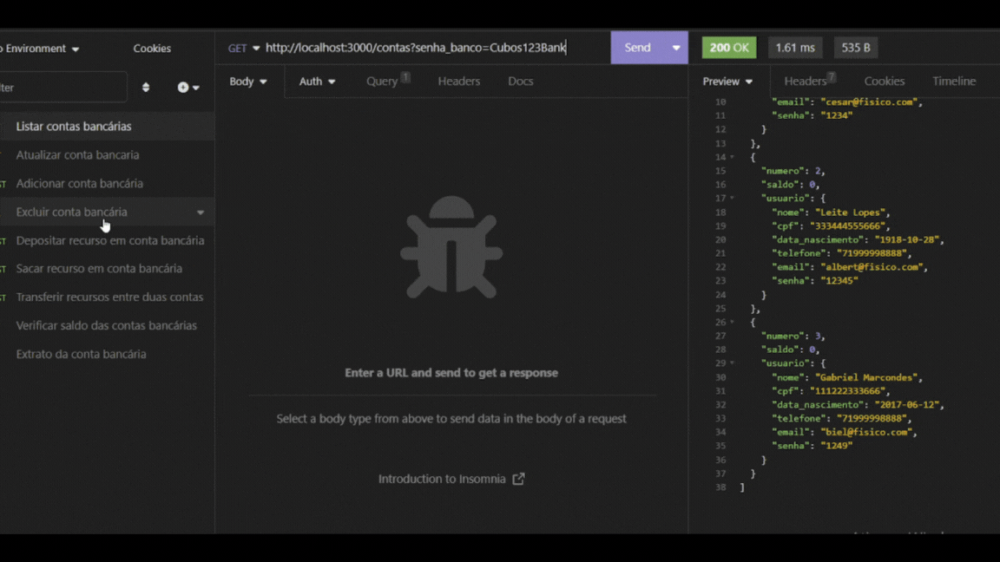
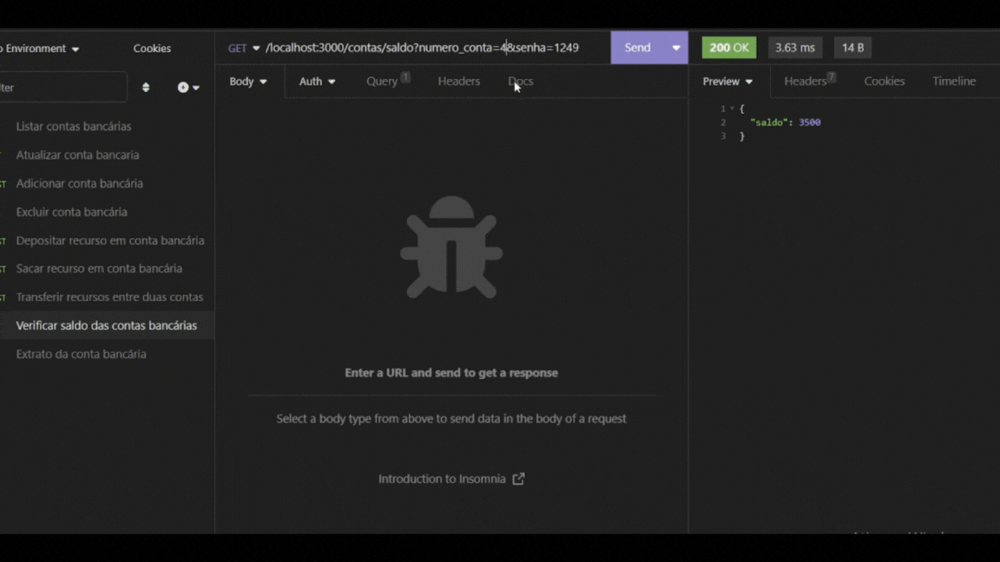

# 🏦 Back-end - API REST: Banco Digital

<p align="center">
  

  
  
  <a href="https://github.com/polianams/api-banco-digital/commits/main">
    
  </a>
  
   <a href="https://www.linkedin.com/in/polianams/">
    
   </a>
   
   <a href="https://github.com/polianams/api-banco-digital/stargazers">
    
  </a>
</p>

<h4 align=center> 
	🚧 Banco Digital CUBOS 🚧
</h4>

<p align="center">
	
</p>

## 📝 Sobre o Projeto

Esse projeto é uma API REST que simula operações bancárias, proporcionando uma base para o desenvolvimento de um Banco Digital. Seguindo os padrões REST e utilizando tecnologias como Node.js e PostgreSQL, oferece funcionalidades como criação de contas, saques, transferências e histórico de transações.

## 📋 Funcionalidades Principais

Nessa API REST é possível:

- Listar contas bancárias (com um middleware obrigatório);
- Criar conta bancária, com requesitos obrigatórios como: nome, cpf, data_nascimento, telefone, email, senha
- Atualizar os dados do usuário da conta bancária;
- Excluir uma conta bancária;
- Depósitar em uma conta bancária;
- Sacar recursos (dinheiro) de uma conta bancária;
- Transferir valores entre contas bancárias;
- Consultar saldo da conta bancária de uma conta específica;
- Emitir extrato bancário de uma conta específica.

## ▶️ Como executar o projeto

### 🛠️ Pré-requisitos

- Possuir um editor de código-fonte, por exemplo [VSCode](https://code.visualstudio.com/download) ou [Vim](https://www.vim.org/download.php);
- Possuir o [Git](https://git-scm.com/downloads) ou qualquer outro programa de versionamento;
- Possuir o [Node.js](https://nodejs.org/en/download/current) (versão 18.16.0 ou superior);
- Possuir o [Insomnia](https://insomnia.rest/download) instalado.

### ⚙️ Instalação

1. Clone este repositório em sua máquina local:
2. Navegue até o diretório do projeto:
   
```
cd nome_da_pasta
```

4. Instale as dependências através do comando:
   
```
npm install
```

6. Para executa-lo digite no terminal do seu editor de código:
   
```
npm run dev
```

8. No terminal, aparecerá a seguinte mensagem:
   
```
O Servidor está sendo executado na porta 3000.
```

10. Após exibir a mensagem acima, execute o Insomnia e configure um novo ambiente para testar as rotas da API.

## 🚀 Tecnologias Utilizadas

- Node.js (versão 18.16.0);
- Express (versão 4.18.2);
- Nodemon (versão 3.0.1);
- Date-fns (versão 2.30.0);
- JavaScript.

## 🎲 Demonstração da Aplicação

<h1 align="center">
    
    
    
</h1>

## 🤝 Contribuição

Contribuições são bem-vindas! Se você quiser melhorar ou adicionar novos recursos a esta API, siga as etapas abaixo:

1. Crie um Fork deste repositório;
2. Crie uma branch para suas alterações:
   
```
git checkout -b my-feature
```

4. Commit suas alterações:
   
```
git commit -m 'Adicionar nova funcionalidade'
```

6. Faça push para a branch:

```
git push origin my-feature
```

6. Abra um pull request.

## 🧙‍♂️ Autora

Projeto Back-end desenvolvido por [Poliana Santos](https://www.linkedin.com/in/polianams/) e [Stephanie Feliciano](https://www.linkedin.com/in/stephanie-santana-feliciano-b02333131/), como desafio do modulo 2 do curso de Desenvolvimento de Software - Foco em Back-end da [Cubos Academy](https://cubos.academy/) ✨

---

## 📝 Licença

<!-- Este projeto esta sobe a licença [MIT](./LICENSE). -->

Feito por Poliana Santos 👋🏽 [Entre em contato!](https://www.linkedin.com/in/polianams/)

Divirta-se explorando a API! 🌟
